<div align="center">



# CooL

### The Black Box for AI.

**Every AI change can be automatically captured, cryptographically recorded, and independently verified.**

[](https://github.com/Northwind-Cipher/cool-sdk/actions/workflows/ci.yml)
[](LICENSE)
[](https://nodejs.org)

</div>

---

## What CooL is

CooL is a developer SDK and command line for producing **independently verifiable evidence about what software did**. Your application records an event; CooL returns a
self-contained receipt that anyone can check later, with no account and no trust in CooL, proving:

- **which software** ran (name, version, content digest) and **which event** happened,
- that the record **has not been altered** (a hybrid **ML-DSA-65 + Ed25519** signature over a deterministic commitment),
- that it sits in an **append-only log** (RFC 6962 inclusion proofs under signed tree heads),
- and, when it runs inside an Intel TDX confidential VM, **where it ran**: the enclave measurement and a quote whose `report_data` commits to the signing key.

Sensitive values are committed as salted hashes and discarded; receipts never carry plaintext. CooL records **what happened**. It does not judge whether it was correct, fair or safe.

## Capabilities

| Capability | What it does | Notes |
|---|---|---|
| **SDK** | `CooL` (simple) and `CoolTee` (advanced, policy control) | TypeScript, ESM, Node >= 20 |
| **Receipts** | `cool.receipt.v2` envelope with a signed `cool.evidence.v1` record | Canonical CBOR, salted commitments |
| **Cryptographic verification** | Binding hash, hybrid signature, inclusion, witnesses, attestation, enclave | Structured verdict per domain, never a bare boolean |
| **Append-only log** | RFC 6962 Merkle tree, signed tree heads | File-backed and in-memory logs |
| **Consistency** | `verifyLogConsistency` checks that receipts from one log describe a single append-only history | Derives proofs itself; detects forks and altered heads |
| **Witness** | `Witness` observes a log, verifies it, remembers what it signed and refuses forks or rollbacks; `witnessThreshold` makes witnesses mandatory | Run it as a separate process with its own key |
| **Intel TDX integration** | dstack guest-agent client, measurement-sealed keys, quote binding | Validated on Phala Cloud (see `artifacts/`) |
| **Attestation** | Quote checked by a configured verifier (for example Phala Cloud's attestation service) | Online unless you supply a local verifier with collateral |
| **Runtime status** | `REAL`, `UNVERIFIED`, `SIMULATED`, `UNAVAILABLE`, or a specific failure, derived from evidence | Never from configuration or a vendor label |
| **CLI** | `cool status`, `seal`, `verify`, `records`, `wire`, `ui` | `COOL_REQUIRE_HARDWARE=1` fails closed |

### Simulator versus real hardware

Without a dstack agent CooL runs a clearly labelled **simulator** (`intel-tdx · SIMULATED`); every receipt says `simulated` and the verifier never reports it as `pass`.
`REAL` is shown only when a dstack agent supplies a complete non-zero MRTD/RTMR0-3 and identity, a quote is obtained, a configured verifier chains it to a vendor root, and any
measurement pin holds. A reachable endpoint alone is `UNVERIFIED`. With `COOL_REQUIRE_HARDWARE=1` (or `policy.allowSimulated: false` and `requireHardware`) anything other than `REAL` is an error.

### Verification limitations

- Binding, signature and inclusion verify offline. **Hardware quote verification is online** through the verifier you configure; a local check needs collateral you supply.
- CooL records the TCB status as `Unknown`; it does not evaluate TCB itself, and it does not check quote freshness.
- Measurement pins are only as trustworthy as the process that approves them.
- A witness proves separation of key custody and process, not that a different organization operates it.
- Validation to date used Intel TDX CPU instances with a development OS image. No GPU or confidential-GPU attestation is claimed, and no third-party certification or audit exists.

## Quick start

```sh
npm install cool-nwc        # Node >= 20
```

```ts
import { CooL, verifyEvidence } from "cool-nwc";

const cool = new CooL({ applicationId: "my-app" });
const { evidence } = await cool.record({
  type: "model.execution",
  metadata: { model: "my-model", version: "1.0.0" },
  payloads: { input: "the request", output: "the response" },
});
console.log((await verifyEvidence(evidence)).ok);
```

## Deployment

```sh
git clone https://github.com/Northwind-Cipher/cool-sdk.git && cd cool-sdk
npm install
npm run typecheck && npm run build && npm test
```

Hardware deployment (Intel TDX on Phala Cloud):

1. Build and push a container image of your workload.
2. Mount `/var/run/dstack.sock` into the container and deploy with the Phala CLI (`phala deploy --compose docker-compose.yaml --instance-type tdx.small`).
3. Set `QUOTE_VERIFIER_URL` (`phala` selects Phala Cloud's attestation service) and pin the approved image with `COOL_EXPECTED_MEASUREMENT`.
4. Require hardware in production: `COOL_REQUIRE_HARDWARE=1`.

Reproduction of the recorded validation: `COOL_PHALA_REPRODUCTION.md`. Architecture, evidence format, attestation and threat model: `docs/`.

## Validation evidence

`artifacts/` holds the V1 validation evidence generated on Phala Cloud Intel TDX hardware (receipts, quotes, verification outputs, tamper and workload-change tests, a witness
running in a separate CVM, an evidence manifest). It is a historical record of specific runs, not a certification. Start with `artifacts/closure-verification-matrix.md`.

## License

CooL is licensed under the **Business Source License 1.1** (`LICENSE`). BSL 1.1 is **not an open source license**; it is a source-available license that converts to an open source license on a set date.

- **Permitted:** copying, modifying, creating derivative works, and redistributing the source, and **non-production use** (development, testing, evaluation, research, education).
- **Production use** is permitted if you and your affiliates, taken together, have annual recurring revenue (ARR) of **less than $1,000,000 USD**.
- **At or above that threshold**, production use requires a **separate commercial license** from Northwind Cipher Pvt. Ltd.
- **Change Date: January 1, 2030.** On that date (or the fourth anniversary of the first public distribution of a given version, whichever comes first) that version becomes available under the **Apache License, Version 2.0**.
- Use outside these terms terminates your rights under the license. The license grants no trademark rights.
- Versions released before this license change (for example `cool-nwc@3.0.0`) were published under Apache-2.0 and remain available under it. A few vendored files keep their original Apache-2.0 license (`docs/IP-OWNERSHIP.md`).

Third-party components keep their own licenses: `docs/THIRD_PARTY_LICENSES.md`, `NOTICE.txt`. For commercial licensing, use the contact channel on the Northwind-Cipher GitHub organization profile.

## Security and contributing

`SECURITY.md` (vulnerability reporting), `CONTRIBUTING.md`, `docs/IP-OWNERSHIP.md`, `docs/IP-PROTECTION-REPORT.md`.

Copyright (c) 2026 Northwind Cipher Pvt. Ltd.
