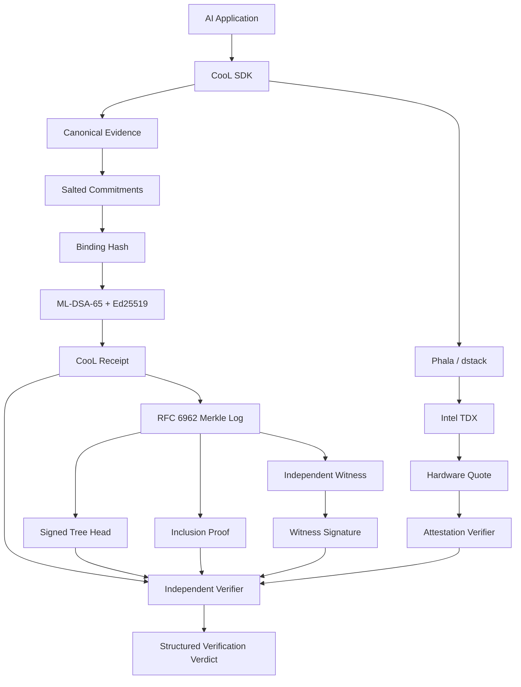

<div align="center">



# CooL

### The Black Box for AI.

**Cryptographically capture what an AI system did, prove where it ran, and let anyone verify the evidence.**

<br>

```text
░░░░░░░░    ████████  ██   ██  █████  ██       █████
░░░░░░░░    ██       ██   ██ ██   ██ ██      ██   ██
░░░░░░░░    ██       ██   ██ ██   ██ ██      ██   ██
░░██░░░░    █████     █████  ███████ ██      ███████
░░██░░░░    ██          ██   ██   ██ ██      ██   ██
░░██░░░░    ██          ██   ██   ██ ██      ██   ██
░░░░░░░░    ██          ██   ██   ██ ███████ ██   ██
░░░░░░░░
```

**POWERED BY PHALA**

*Confidential execution · Hardware-backed attestation · Verifiable runtime*

<br>

[](https://github.com/Northwind-Cipher/cool-sdk/actions/workflows/ci.yml)
[](LICENSE)
[](https://nodejs.org)
[](https://phala.com/confidential-vm)
[](https://phala.com/)

</div>

---

<div align="center">

> **AI should produce evidence, not just claims.**

CooL is a developer SDK + CLI for turning AI executions into **portable, cryptographically verifiable evidence**.

**Built for confidential execution. Built for independent verification. Powered by Phala.**

</div>

---

## What CooL does

An AI application records an event. CooL turns that event into a signed, independently verifiable receipt.

```text
┌────────────────────┐
│    AI WORKLOAD     │
│                    │
│ model / input /    │
│ output / metadata  │
└─────────┬──────────┘
          │
          ▼
┌────────────────────┐
│        CooL        │
│                    │
│ canonicalize       │
│ commit             │
│ sign               │
│ log                │
│ attest             │
└─────────┬──────────┘
          │
          ▼
┌──────────────────────────────────┐
│        VERIFIABLE RECEIPT        │
│                                  │
│  ✓ binding hash                  │
│  ✓ ML-DSA-65 + Ed25519           │
│  ✓ Merkle inclusion              │
│  ✓ signed tree head              │
│  ✓ witness evidence              │
│  ✓ TEE attestation               │
└─────────┬────────────────────────┘
          │
          ▼
┌────────────────────┐
│    ANY VERIFIER    │
│                    │
│ independently      │
│ checks the evidence│
└────────────────────┘
```

CooL records **what happened**. It does not decide whether the result was correct, fair, safe, or desirable.

---

# Why CooL?

Traditional application logs answer:

```text
"What did the application tell me happened?"
```

CooL is designed to answer:

```text
"What cryptographic evidence can I independently verify about what happened?"
```

The SDK binds software identity, execution metadata, model information and committed payloads into a deterministic evidence record.

That evidence can then be protected by:

- **hybrid cryptographic signatures**
- **append-only transparency logging**
- **independent witnesses**
- **hardware-backed TEE attestation**
- **measurement-bound execution identity**

---

# Powered by Phala

```text
░░░░░░░░    ████████  ██   ██  █████  ██       █████
░░░░░░░░    ██       ██   ██ ██   ██ ██      ██   ██
░░░░░░░░    ██       ██   ██ ██   ██ ██      ██   ██
░░██░░░░    █████     █████  ███████ ██      ███████
░░██░░░░    ██          ██   ██   ██ ██      ██   ██
░░██░░░░    ██          ██   ██   ██ ██      ██   ██
░░░░░░░░    ██          ██   ██   ██ ███████ ██   ██
░░░░░░░░
```

### CooL × Phala

**CooL uses the Phala / dstack confidential-computing stack as its hardware-backed execution and attestation layer.**

```text
                         CooL
            ┌──────────────────────────┐
            │ Evidence + Verification   │
            │                          │
            │ • canonical records      │
            │ • cryptographic binding  │
            │ • hybrid signatures      │
            │ • Merkle transparency    │
            │ • witnesses              │
            │ • receipt verification   │
            └────────────┬─────────────┘
                         │
                         ▼
                   Phala / dstack
            ┌──────────────────────────┐
            │ Confidential Runtime     │
            │                          │
            │ • workload identity      │
            │ • measurements           │
            │ • key sealing            │
            │ • quote retrieval        │
            │ • attestation            │
            └────────────┬─────────────┘
                         │
                         ▼
                    Intel TDX
            ┌──────────────────────────┐
            │ Hardware-backed          │
            │ confidential execution   │
            └──────────────────────────┘
```

Phala provides the confidential execution infrastructure underneath the CooL hardware-verification path.

CooL consumes the resulting execution evidence and binds it into its own independently verifiable evidence model.

**Phala:** [phala.com](https://phala.com/)  
**dstack:** [phala.com/dstack](https://phala.com/dstack)  
**Confidential VM:** [phala.com/confidential-vm](https://phala.com/confidential-vm)  
**Phala Cloud:** [cloud.phala.com](https://cloud.phala.com/)

---

# Architecture


```mermaid
flowchart TB
    A["AI Application"] --> B["CooL SDK"]

    B --> C["Canonical Evidence"]
    C --> D["Salted Commitments"]
    D --> E["Binding Hash"]

    E --> F["ML-DSA-65 + Ed25519"]
    F --> G["CooL Receipt"]

    G --> H["RFC 6962 Merkle Log"]
    H --> I["Signed Tree Head"]
    H --> J["Inclusion Proof"]

    H --> K["Independent Witness"]
    K --> L["Witness Signature"]

    B --> M["Phala / dstack"]
    M --> N["Intel TDX"]
    N --> O["Hardware Quote"]
    O --> P["Attestation Verifier"]

    G --> Q["Independent Verifier"]
    I --> Q
    J --> Q
    L --> Q
    P --> Q

    Q --> R["Structured Verification Verdict"]
```

---

# Evidence pipeline

| Domain | Evidence | What is checked |
|---|---|---|
| **Binding** | Deterministic hash | Evidence has not changed |
| **Signature** | ML-DSA-65 + Ed25519 | Evidence was signed by the expected key |
| **Transparency** | Merkle inclusion proof | Receipt belongs to the append-only log |
| **Consistency** | Tree consistency proof | Receipts describe one append-only history |
| **Witness** | Independent witness signature | External process observed and accepted log state |
| **Attestation** | TDX quote + measurement | Workload ran inside the verified execution boundary |
| **Runtime** | Evidence-derived status | Status reflects evidence rather than configuration |

---

# Capabilities

| Capability | Details |
|---|---|
| **SDK** | `CooL` for simple use, `CoolTee` for advanced policy and hardware control |
| **Receipts** | `cool.receipt.v2` containing signed `cool.evidence.v1` |
| **Canonical encoding** | Deterministic CBOR |
| **Privacy** | Sensitive values represented using salted commitments |
| **Hybrid signatures** | ML-DSA-65 + Ed25519 |
| **Transparency** | RFC 6962 Merkle tree + signed tree heads |
| **Consistency** | Detects forks, rollbacks and incompatible log histories |
| **Witnesses** | Separate process can verify and sign observed log state |
| **Phala integration** | Phala / dstack confidential execution path |
| **Intel TDX** | Hardware-backed execution measurement and quote binding |
| **Attestation** | Configured quote verification |
| **CLI** | `status`, `seal`, `verify`, `records`, `wire`, `ui` |
| **Production enforcement** | `COOL_REQUIRE_HARDWARE=1` |

---

# Quick start

## Install

```bash
npm install cool-nwc
```

Requires Node.js `>= 20`.

## Record an AI execution

```ts
import { CooL, verifyEvidence } from "cool-nwc";

const cool = new CooL({
  applicationId: "my-app",
});

const { evidence } = await cool.record({
  type: "model.execution",

  metadata: {
    model: "my-model",
    version: "1.0.0",
  },

  payloads: {
    input: "the request",
    output: "the response",
  },
});

const verdict = await verifyEvidence(evidence);

console.log(verdict.ok);
```

---

# What a receipt contains

```text
cool.receipt.v2
│
├── cool.evidence.v1
│   ├── application identity
│   ├── software identity
│   ├── execution metadata
│   ├── model identity
│   ├── input commitment
│   ├── output commitment
│   ├── timestamp
│   └── binding hash
│
├── signature
│   ├── ML-DSA-65
│   └── Ed25519
│
├── transparency
│   ├── Merkle root
│   ├── signed tree head
│   └── inclusion proof
│
├── witness
│   └── independent witness evidence
│
└── attestation
    ├── TEE measurement
    ├── quote
    ├── report_data binding
    └── verifier result
```

---

# Cryptographic model

### 01 — Canonical evidence

```text
event
  │
  ▼
canonical CBOR
  │
  ▼
deterministic bytes
```

### 02 — Binding

```text
software identity ──┐
model identity ─────┤
input commitment ───┤
output commitment ──┤──► evidence ──► binding hash
timestamp ──────────┤
metadata ───────────┘
```

### 03 — Hybrid signature

```text
                 binding hash
                      │
             ┌────────┴────────┐
             ▼                 ▼
        ML-DSA-65          Ed25519
             │                 │
             └────────┬────────┘
                      ▼
               signed evidence
```

### 04 — Transparency

```text
receipt
   │
   ▼
Merkle leaf
   │
   ▼
RFC 6962 tree
   │
   ▼
signed tree head
   │
   ▼
inclusion proof
```

---

# Confidential execution

```text
┌──────────────────────────────┐
│          CooL SDK            │
│                              │
│  evidence + signing + log    │
└──────────────┬───────────────┘
               │
               ▼
┌──────────────────────────────┐
│        Phala / dstack        │
│                              │
│  workload identity           │
│  measurement                 │
│  key sealing                 │
│  quote retrieval             │
└──────────────┬───────────────┘
               │
               ▼
┌──────────────────────────────┐
│          Intel TDX           │
│                              │
│  measured confidential VM    │
│  hardware-backed isolation   │
└──────────────┬───────────────┘
               │
               ▼
        remote attestation
               │
               ▼
┌──────────────────────────────┐
│       CooL verifier          │
│                              │
│  quote + measurement +       │
│  identity + policy           │
└──────────────────────────────┘
```

---

# Hardware status

The current CooL validation path uses **real Phala-backed Intel TDX execution**.

There is no simulated hardware state being presented as production validation.

The intended production chain is:

```text
CooL workload
     │
     ▼
Phala / dstack
     │
     ▼
Intel TDX measurement
     │
     ▼
hardware quote
     │
     ▼
configured verifier
     │
     ▼
measurement / identity policy
     │
     ▼
REAL
```

Production deployments can enforce hardware-backed execution with:

```bash
COOL_REQUIRE_HARDWARE=1
```

---

# Deployment

## Development

```bash
git clone https://github.com/Northwind-Cipher/cool-sdk.git
cd cool-sdk

npm install

npm run typecheck
npm run build
npm test
```

## Phala Cloud / Intel TDX

Build and push the workload image, then deploy through the Phala workflow:

```bash
phala deploy   --compose docker-compose.yaml   --instance-type tdx.small
```

Mount the dstack socket:

```text
/var/run/dstack.sock
```

Configure the verifier and expected measurement:

```bash
QUOTE_VERIFIER_URL=<verifier>
COOL_EXPECTED_MEASUREMENT=<approved-measurement>
COOL_REQUIRE_HARDWARE=1
```

The production path is intended to fail closed when the expected hardware-backed evidence cannot be established.

---

# CLI

```bash
cool status
cool seal
cool verify
cool records
cool wire
cool ui
```

---

# Validation evidence

The repository contains the recorded validation material under:

```text
artifacts/
```

Start with:

```text
artifacts/closure-verification-matrix.md
```

The evidence set covers the documented hardware validation path, including:

- receipts,
- TDX quotes,
- verification outputs,
- tamper tests,
- workload-change tests,
- witness execution,
- evidence manifests.

These artifacts document actual validation runs. They are not a blanket certification of every deployment.

---

# Verification limitations

CooL verifies specific properties of execution evidence.

It does not establish:

- model correctness,
- output quality,
- fairness,
- legal compliance,
- policy compliance,
- or desirability of an AI result.

A valid cryptographic receipt is evidence about execution, not a certificate that the result was good.

### Attestation

Hardware quote verification depends on the configured verification path unless the required collateral and a local verifier are supplied.

### TCB

CooL records the TCB status as `Unknown`. It does not independently evaluate TCB quality or quote freshness.

### Measurement pins

A measurement pin is only as trustworthy as the process used to approve it.

### Witnesses

A witness separates observation from the process producing the log. It does not by itself prove organizational independence.

---

# Standards & primitives

| Standard / primitive | Role |
|---|---|
| **FIPS 204 / ML-DSA-65** | Post-quantum signatures |
| **Ed25519** | Classical signatures |
| **FIPS 203 / ML-KEM-1024** | Post-quantum key encapsulation where used |
| **X25519** | Classical key agreement |
| **ChaCha20-Poly1305** | AEAD channel encryption |
| **SHA-256** | Hashing and commitments |
| **CBOR** | Canonical serialization |
| **RFC 6962** | Merkle transparency log construction |
| **RFC 3161** | Timestamping integration |
| **Intel TDX** | Confidential CPU execution and attestation |
| **Phala / dstack** | Confidential runtime and attestation infrastructure |

---

# Threat model

CooL is designed for environments where a verifier should not have to blindly trust the application operator or storage layer.

```text
             APPLICATION
                  │
                  ▼
          cryptographic binding
                  │
                  ▼
           hybrid signature
                  │
                  ▼
          transparency log
                  │
                  ▼
              witness
                  │
                  ▼
          Phala / dstack TEE
                  │
                  ▼
            Intel TDX quote
                  │
                  ▼
        independent verifier
```

The objective is to make important claims **independently checkable**.

---

# Repository structure

```text
cool-sdk/
│
├── src/
│   ├── sdk/
│   ├── crypto/
│   ├── evidence/
│   ├── log/
│   ├── witness/
│   ├── attestation/
│   └── verification/
│
├── examples/
├── artifacts/
├── docs/
├── SECURITY.md
├── CONTRIBUTING.md
├── NOTICE.txt
├── LICENSE
└── README.md
```

---

# Security

For vulnerability reporting:

```text
SECURITY.md
```

Please do not disclose exploitable vulnerabilities through public GitHub issues.

---

# Contributing

```bash
npm install
npm run typecheck
npm run build
npm test
```

See:

```text
CONTRIBUTING.md
```

---

# License

CooL is licensed under the **Business Source License 1.1 (BUSL-1.1)**.

BUSL-1.1 is a source-available license, not an open-source license.

Production use is permitted when you and your affiliates, taken together, have annual recurring revenue below:

```text
$1,000,000 USD
```

At or above that threshold, production use requires a separate commercial license from **Northwind Cipher Pvt. Ltd.**

### Change date

```text
January 1, 2030
```

On the change date, or the fourth anniversary of first public distribution of a given version, whichever comes first, that version becomes available under:

```text
Apache License 2.0
```

Versions released before this license change, including:

```text
cool-nwc@3.0.0
```

were published under Apache-2.0 and remain available under that license.

See:

```text
docs/THIRD_PARTY_LICENSES.md
NOTICE.txt
LICENSE
```

for complete licensing information.

---

<div align="center">

# CooL

### The Black Box for AI.

**Cryptographic observability for AI execution.**

<br>

```text
░░░░░░░░    ████████  ██   ██  █████  ██       █████
░░░░░░░░    ██       ██   ██ ██   ██ ██      ██   ██
░░░░░░░░    ██       ██   ██ ██   ██ ██      ██   ██
░░██░░░░    █████     █████  ███████ ██      ███████
░░██░░░░    ██          ██   ██   ██ ██      ██   ██
░░██░░░░    ██          ██   ██   ██ ██      ██   ██
░░░░░░░░    ██          ██   ██   ██ ███████ ██   ██
░░░░░░░░
```

**POWERED BY PHALA**

*Confidential execution · Hardware-backed attestation · Verifiable runtime*

<br>

[Phala](https://phala.com/) ·
[dstack](https://phala.com/dstack) ·
[Phala Cloud](https://cloud.phala.com/) ·
[Documentation](docs/) ·
[GitHub](https://github.com/Northwind-Cipher/cool-sdk)

<br><br>

**© 2026 Northwind Cipher Pvt. Ltd.**

</div>
